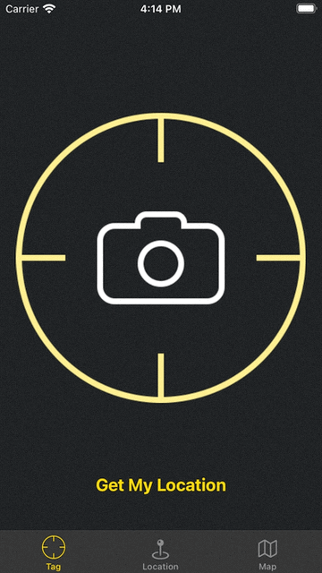
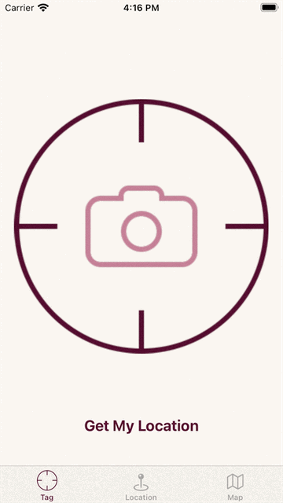

### Basic Overview
This app made for saving your favorite locations you've been to. It is based on the third *IOS Apprentice* book.
**MyLocation app** uses the Core Location framework to obtain GPS coordinates for the user’s whereabouts, Map Kit to show the user’s favorite locations on a map, the iPhone’s camera and photo library to attach photos to these locations, and finally, Core Data to store everything in a database. 

### Technologies used
- UIKit
- CoreData
- CoreLocation
- MapKit
- CAAnimation

	
	

`